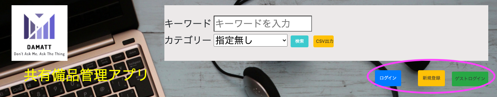
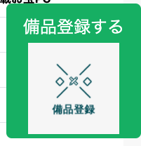
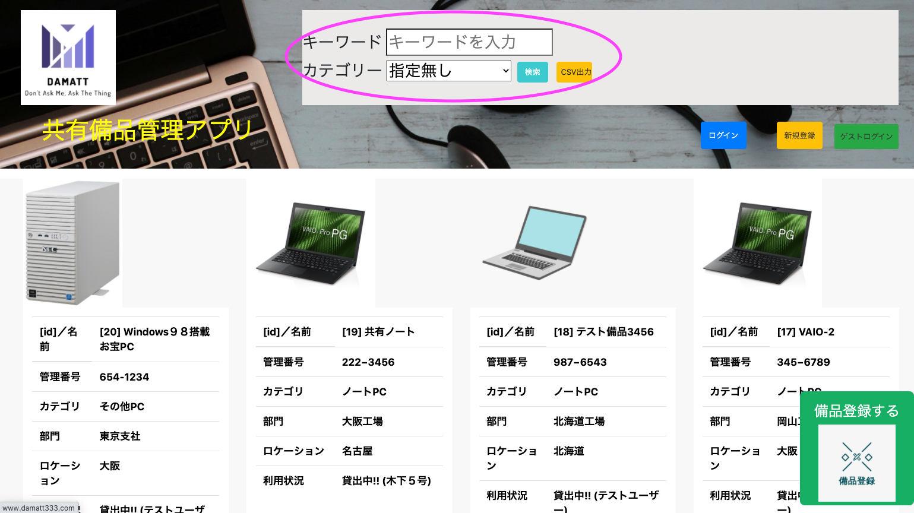
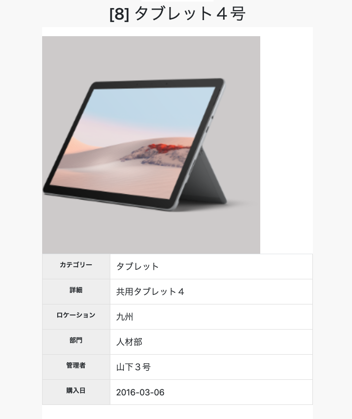
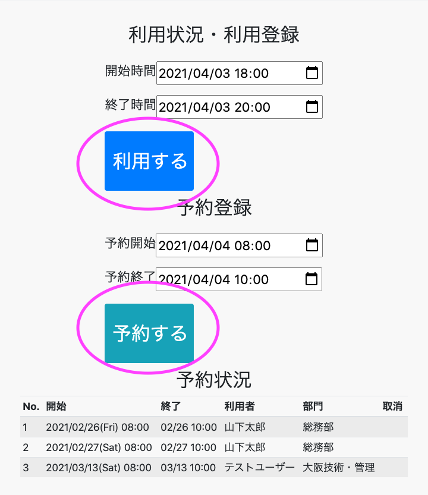
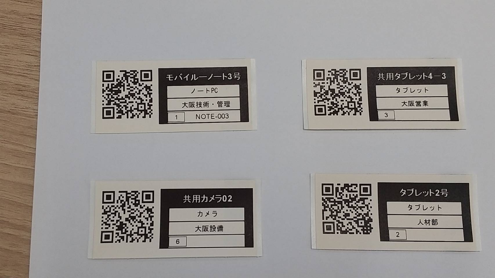
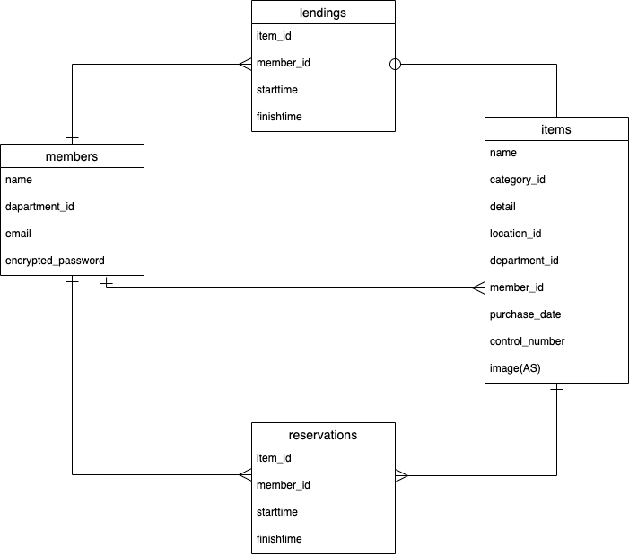

## アプリケーション名
### DAMATT
Don't Ask Me, Ask The Thing

## URL
### http://www.damatt333.com

## アプリケーション概要
会社やサークルなど、グループで使用している共有品の使用状況や予約状況を管理出来るアプリケーションです。

## 開発環境
- フロントエンド：HTML&CSS / Bootstrap
- バックエンド：Ruby / Ruby on Rails
- インフラ：AWS (EC2 / S3)
- テキストエディタ：Visual Studio

## ログイン方法
ヘッダー右側の「ゲストログイン」ボタンを押すことで、テストユーザーとしてログインすることが可能です。
また、「新規登録」ボタンから、ユーザー登録してアプリを利用することも出来ます。


## アプリケーション利用方法

### 1.共有備品の登録


トップ画面右下の「備品登録」ボタンを押して、備品の登録が出来ます。備品の画像、カテゴリー、備品の説明、管理部門などを登録します。

### 2.共有備品の一覧表示と検索機能


トップ画面で、登録済みの共有備品の一覧が表示されます。ヘッダー部分から、キーワードやカテゴリーによる検索が出来ます。また、画面上に検索結果を表示する意外に、「CSV出力」を押すことで、検索条件に合致する共有備品データをCSV形式でデータ出力することが出来ます。

### 3.共有備品の詳細情報表示
詳細情報表示画面では、対象となる共有備品の詳細情報が表示されるのに加えて、
- 利用登録
- 予約登録

を行うことが出来ます。





利用登録は、対象となる共有備品が未利用時には「利用する」ボタンが画面上に表示されます。利用時間を決めて、「利用する」ボタンを押すことで即座に利用することが出来ます。既に自分以外の利用者に利用されている場合は、画面上には「貸出中」と表示されるだけdす。自分自身が利用している場合には、「返却する」ボタンが表示され、そのボタンを押すことで返却することが出来ます。

予約登録は、対象となる共有備品が利用中か否かに関わらず、行うことが出来ます。予約開始日時と予約終了日時を指定して「予約する」ボタンを押すことで予約することが出来ます。予約は複数回行うことが出来ます。なお、予約時間の重複チェックは行っていません。

現在の予約状況は画面下部に予約開始時間順に表示されます。利用者自身の予約については、「取消」ボタンを押すことで取り消すことが出来ます。

共有備品の登録情報を変更したり一覧から削除したり出来るのは、管理者が利用者自身であるか、利用者の部門と共有備品の部門が同じ場合となっています。なお、貸出中の場合、登録情報を変更したり削除したりは出来ません。

### 4.スマホを用いた利用
利用登録や予約登録はPC画面でも出来ますが、より実際的な利用に仕方としては、スマホを用いた利用を想定しています。対象となる共有備品にはQRコード付きラベルを貼付しておき、自身のスマホを使いカメラ機能を利用してQRをスキャンすることで直接共有備品の詳細表示画面にジャンプすることが出来ます。
1. スキャンする
2. 画面タッチする
3. 利用する／予約する

少ないステップで利用や予約が出来るので、利用者に負担を与えずに利用してもらえるようになっています。



このREADME上のサンプルをスマホなど使ってQRコードを読み取ってもらうと、実際にDAMATTアプリが立ち上がり、操作感など実感してもらえます。

### 5.QRコード付きラベルの作成
登録済みの共有備品は、CSVによるデータ出力が可能です。QRコード付きラベルは、プリンターメーカーが提供しているユーティリティソフトを利用します。今回は、brotherのP-touch Editorを使いました。

[brother P-touch Editor](https://www.brother.co.jp/product/labelprinter/editor/index.aspx)

## 制作背景
このアプリを作成した背景として、以下のようなやり取りを耳にしたことがありました。

A：「このノートパソコン、来週新人研修用に使いたいのだけど、使って良いかな？」<br>
B：「さあー、来週の予定は分からないや・・・」<br>
A：「誰に聞けば良い？」<br>
B：「Cさんかな？分からないわ・・・」<br>
A：「・・・」<br>
B：「・・・」<br>
この手のやり取りは社内でしばしば耳にします。
- **このような不毛なやり取りを無くしたい！**
- **目の前に使いたいモノがあるのなら、誰か人に聞かなくても、そのモノが答えてくれれば良い！！**


と言うコトで、そのモノにQRコード貼って、スマホでQRコード読み取り、そのモノの詳細画面にジャンプすれば、予約状況が直ぐ分かり予約も出来る。また、直ぐに使うなら「使用」ボタンを押せば誰が使っているか他の人も分かる。返す時も同じく、QRコードスキャンして、「返却」ボタンを押せばそれでおしまい。
誰に聞けば良いか分からない、と言うコト自体を無くすことで、関係者全員がみんなハッピーになれる♪

というものでした。
アプリケーション名のDAMATTは、<br>
「Don't Ask Me, Ask The Thing」<br>
(私に聞かずにそのモノに聞いてくれ)<br>
から取っています。

## 主な想定利用者
- 小～中規模の会社や組織。数十人くらいまでをイメージ。
- 何となく備品の使用状況や予約状況を聞かれることが多くて、一々答えるのが面倒な人。
- 目の前に使いたいものがあるのだけれど、誰に聞いたら良いか分からない彷徨う事が多い人。

## 実装機能一覧
ユーザー管理機能(新規登録・ログイン・ゲストログイン ) / 共有備品登録機能 / 共有備品一覧機能 / 共有備品検索機能 / CSV出力機能 / 利用状況管理機能 / 予約管理機能 / 予約状況一覧機能 / ページネーション機能 / レスポンシブデザイン

## 今後実装予定の機能
- バッティングチェック機能(予約時や利用時に他の予約と時間が被っていないか)
- 同一DBで複数組織での利用可にする機能(現在DBが１つしかないので、一組織でしか使えない。同一DBでも複数の組織が使えるようにする)
- 資産管理的な方向への拡張(単に共有備品の利用・予約管理というだけではなく。ただ余り欲張ると虻蜂取らずになるので当面やらない)。
- 自動送信メールによる注意喚起機能(返却促し機能)
- 予約と利用を結び付けて、事前に予約済みの場合、利用ボタンを押すと自動的に予約が消えるようにする
-
## DB設計


## ローカルでの動作方法
1. ターミナル上で、作業用のディレクトリに移動し、以下のコマンドを実行
```ターミナル
% git clone https://github.com/mittz333/damatt.git
% cd damatt
% bundle install
% yarn install
% rails db:create
% rails db:migrate
% rails s
```

2. ダミーデータの登録
```ターミナル
% rails db:seed
```
画像データについては、ダミーデータは用意していません。

3. ローカルで画像登録できるようにするため、コードの一部を修正
config/environments/development.rb
内の、
- config.active_storage.service = :amazon

を以下のように変更する

- config.active_storage.service = :local


4. http://localhost:3000/ にアクセス
